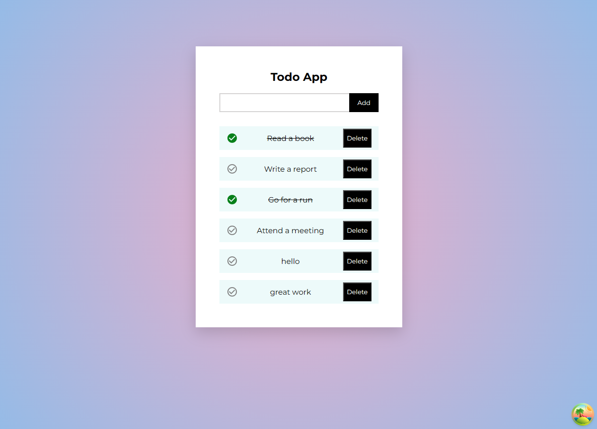

# Todo App 



## Tools & Tech Stack

- NextJS - Framework
- React Query
- Emotion JS - Styling 
- JSON Server

## Getting Started

First, run the development server:

```bash
npm run dev
# or
yarn dev
# or
pnpm dev
# or
bun dev
```
Open [http://localhost:3000](http://localhost:3000) with your browser to see the result.

Then, run the json-server:

```bash
npm run db
```

Open [http://localhost:5000/todos](http://localhost:3000) to see the json server results.
